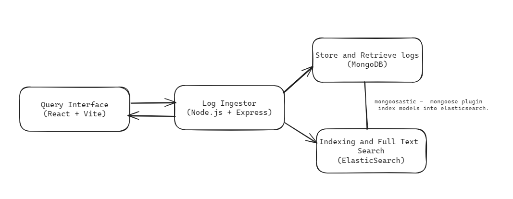

# Log Ingestor and Query Interface

## Overview

This project provides a log ingestor system and a query interface for efficiently handling vast volumes of log data. It leverages Elasticsearch and MongoDB to store and retrieve log information. The system includes a log ingestor that ingests logs in a specified format and a user-friendly query interface for searching and filtering logs based on various criteria.

## Features

- **Log Ingestor:**

  - Mechanism to ingest logs in a specified format.
  - Scalability to handle high volumes of logs efficiently.
  - Integration with MongoDB for persistent storage.
  - Asynchronous indexing into Elasticsearch using `mongoosastic`.
  - HTTP server for log ingestion.

- **Query Interface:**
  - User-friendly interface for full-text search.
  - Filters based on log properties such as level, message, timestamp, etc.
  - Efficient and quick search results.
  - Integration with Elasticsearch for querying indexed log data.

## Technologies

- **Node.js**
- **Express.js**
- **Elasticsearch**
- **MongoDB**
- **React.js + Vite**
- **BullMQ**

## System Diagram



## Log Schema

The log schema defines the structure of the log data that can be ingested into the system. Here's an example schema:

```javascript

  level: { type: String, required: true },
  message: { type: String, required: true },
  resourceId: { type: String, required: true },
  timestamp: { type: Date, required: true },
  traceId: { type: String, required: true },
  spanId: { type: String, required: true },
  commit: { type: String, required: true },
  metadata: {
    parentResourceId: { type: String, required: true },
  },

```

## Getting Started

### Prerequisites

- Node.js and npm installed.
- MongoDB and Elasticsearch servers set up and running.

## Installation

### Server

1. Navigate to the server directory:

   ```bash
   cd server
   npm install
   npm run server
   ```

## Ingesting Logs

To ingest logs into the system, you can use the provided HTTP endpoint. Send a POST request to http://localhost:3000/api/log with the log data in the specified format. You can use tools like curl or Postman, or integrate it into your application.

### Example using curl

```bash
curl -X POST -H "Content-Type: application/json" -d '{
  "level": "error",
  "message": "Failed to connect to DB",
  "resourceId": "server-1234",
  "timestamp": "2023-09-15T08:00:00Z",
  "traceId": "abc-xyz-123",
  "spanId": "span-456",
  "commit": "5e5342f",
  "metadata": {
    "parentResourceId": "server-0987"
  }
}' http://localhost:3000/api/log
```

2. Client (In Development)

   ```bash
   cd client
   npm install
   npm run dev
   ```
